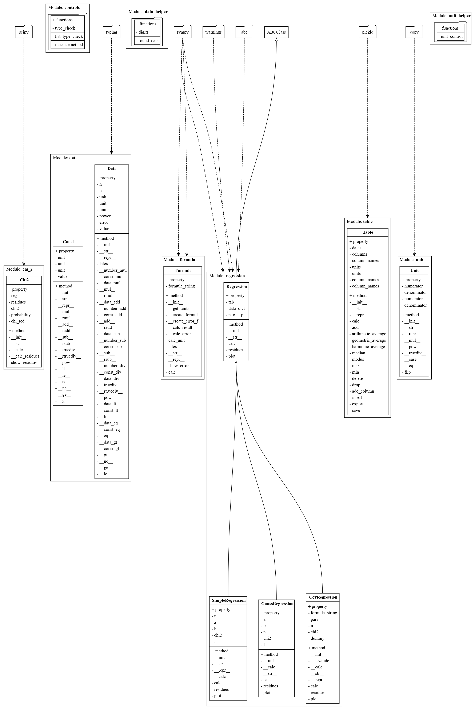

# Code2UML 
Converts python code to .dot-code for simple UML diagrams representing the 
classes and their inheritance as well as module dependencies.

## Example 1
As an simple example the Code of the [pyrror module](https://github.com/YanickT/Pyrror) was used.


```python
from code2uml import Code2UML

path = "../Pyrror"
converter = Code2UML(path, ownmodule="pyrror", ignore=["setup.py", "gitignore", "test", "update", "constants.py"])
converter.export_dot("pyrror")
```

## Example 2
A more complex example is the [hypertiling package](https://git.physik.uni-wuerzburg.de/hypertiling/hypertiling).

